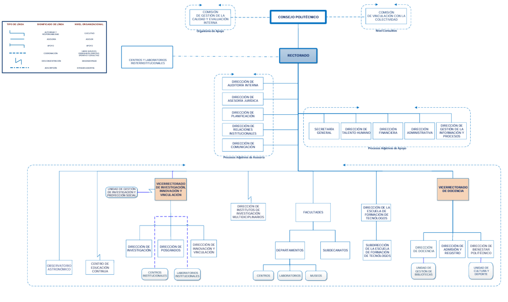

---
output:
  html_document:
    toc: true
    toc_float: true
    df_print: paged
  pdf_document:
    toc: true
---


```{r setup, include=FALSE}
knitr::opts_chunk$set(echo = TRUE)
```

# Evaluación y Predicción de la Madurez Digital en Instituciones de Educación Superior mediante Técnicas de Analítica de Datos

**Autores:** Víctor Santos-Logroño <br>
**Filiación:** Escuela Politécnica Nacional, Departamento de Automatización y Control Industrial <br>
**Contacto:** victor.santos@epn.edu.ec  

# 1. Introducción
La transformación digital se ha consolidado como uno de los pilares estratégicos para la sostenibilidad, competitividad y capacidad de innovación de las instituciones de educación superior (IES). En un entorno caracterizado por la automatización de procesos, la integración de sistemas, el uso intensivo de datos y la necesidad de ofrecer servicios educativos flexibles y eficientes, comprender el estado actual y la proyección futura de la madurez digital institucional se vuelve fundamental.

La madurez digital no solo implica la adopción de tecnologías, sino también la existencia de una visión estratégica, capacidades organizacionales, liderazgo directivo, inversión sostenida, cultura de innovación y una adecuada gestión del cambio. Su evaluación permite:

- Identificar brechas entre el nivel actual y el deseado.

- Priorizar inversiones en infraestructura, talento humano y sistemas.

- Comprender los factores que impulsan o limitan la transformación digital.

- Modelar escenarios futuros para la toma de decisiones basadas en evidencia.

En este contexto, el estudio de la madurez digital requiere no solo el análisis estático de indicadores, sino también el desarrollo de modelos predictivos que permitan anticipar la evolución institucional en función de múltiples factores organizacionales, tecnológicos y culturales.

# 2. Disponibilidad limitada de datos públicos sobre madurez digital en IES
A pesar de la creciente importancia de la transformación digital en IES, la disponibilidad de datasets públicos que permitan estudiar este fenómeno de forma cuantitativa y reproducible es todavía muy limitada. La mayoría de iniciativas de evaluación digital se encuentran en informes privados, auditorías internas o estudios sectoriales cuyos datos no son compartidos por motivos de confidencialidad, competitividad o protección institucional.En consecuencia:

- Acceso limitado a repositorios públicos con métricas longitudinales de madurez digital.

- Los datasets disponibles son principalmente transversales, con un solo levantamiento por institución.

- La diversidad metodológica entre estudios impide la combinación de bases de datos.

Dentro de este contexto, el dataset *Raw OpenData Digital-Survey HEI Germany* disponible en [](https://doi.org/10.5281/zenodo.6383770) representa una de las pocas iniciativas de datos abiertos sobre madurez digital institucional en educación superior a nivel global. Su valor reside principalmente en su alcance, nivel de detalle y metodología. Sin embargo, como se explica a continuación, sus características estructurales lo vuelven inadecuado para ciertos tipos de análisis avanzados, particularmente modelos predictivos supervisados o evaluaciones longitudinales.

## 2.1 Análisis técnico del dataset *Raw OpenData Digital-Survey HEI Germany* y evaluación de su idoneidad
Antes de aplicar cualquier técnica de análisis avanzada es indispensable evaluar la calidad, estructura y capacidad informativa del dataset disponible. En estudios de madurez digital, la calidad del dato adquiere una importancia crítica, ya que la predicción del nivel futuro de digitalización y la identificación de patrones institucionales dependen directamente de la variabilidad interna, la completitud y la riqueza informacional de los ítems evaluados.

Dado que la encuesta *Raw OpenData Digital-Survey HEI Germany* fue publicada de forma agregada y parcialmente anonimizada, es necesario establecer, mediante métricas objetivas, si este dataset posee las condiciones estadísticas mínimas para sostener un análisis predictivo robusto.

### 2.1.1 Proporción global de valores faltantes
Una condición mínima para aplicar técnicas multivariantes o modelos supervisados es disponer de un volumen suficiente de datos observados. Los valores faltantes (NA) reducen el tamaño de la muestra efectiva, generan sesgos y obligan a aplicar imputaciones que disminuyen la fiabilidad del análisis. Por ello, se evalúa la proporción global de NA en el dataset RAW.

```{r}
# Descarga automática del dataset RAW
if (!dir.exists("data")) dir.create("data")

url_raw <- "https://zenodo.org/records/6383770/files/Raw_OpenData_Digital-Survey_HEI-Germany.csv?download=1"
destino <- "data/Raw_OpenData_Digital-Survey_HEI-Germany.csv"

if (!file.exists(destino)) {
  download.file(url_raw, destfile = destino, mode = "wb")
}

file.info(destino)

# Carga del dataset RAW y limpieza inicial
library(dplyr)
library(tidyr)
library(janitor)
library(ggplot2)
library(entropy)

# Lectura correcta del archivo RAW (usa separador ";")
datos_raw <- read.csv(destino,
sep = ";",
header = TRUE,
stringsAsFactors = FALSE,
encoding = "UTF-8")

# Limpieza de nombres de columnas
datos_raw <- clean_names(datos_raw)

# Reemplazo de códigos técnicos por NA
datos_raw <- datos_raw |>
mutate(across(everything(),
~ ifelse(. %in% c(-1, -2, "-1", "-2"), NA, .)))

# Vista general de dimensiones
dim(datos_raw)

# Vista preliminar de las primeras columnas
head(datos_raw[, 1:10])

# Proporción de NA por variable
prop_na <- datos_raw %>%
  summarise(across(everything(), ~ mean(is.na(.)))) %>%
  pivot_longer(everything(), names_to = "variable", values_to = "prop_na")

# Promedio global
mean_na_global <- mean(prop_na$prop_na)
mean_na_global
```

El cálculo muestra que el dataset *Raw OpenData Digital-Survey HEI Germany* presenta una proporción promedio de 84.7% de valores faltantes, lo que indica un nivel crítico de incompletitud. Con un porcentaje tan elevado, la mayoría de variables carece de suficientes datos para permitir análisis multivariados, clustering o modelos predictivos confiables, ya que solo alrededor del 15% de la información esperada está realmente disponible. 

Este grado de ausencia sugiere una encuesta con fuerte heterogeneidad en la respuesta (no todas las instituciones contestan los mismos bloques), generando una matriz extremadamente dispersa que imposibilita aplicar técnicas estadísticas estándar.

### 2.1.2 Variedad y estabilidad informativa de las variables
La calidad de un dataset para análisis multivariante o predictivo depende no solo de la ausencia de valores faltantes, sino también del grado de información útil que contienen sus variables.
En encuestas de madurez digital, es habitual que muchas preguntas no sean respondidas o presenten patrones de respuesta demasiado homogéneos, lo cual impide extraer estructura estadística.

Por ello, se evalúa la *entropía de Shannon* de cada variable, una medida estándar que cuantifica cuánta información aporta:

- Entropía baja: la variable casi no cambia, aporta poca señal.

- Entropía alta: la variable tiene variación significativa, es potencialmente útil.

Este paso permite identificar si el dataset posee suficientes variables informatívamente estables como para justificar análisis posteriores.

```{r}
# Seleccionar solo variables categóricas o numéricas convertidas a factor
datos_entropia <- datos_raw |>
mutate(across(everything(), as.factor))

# Función para calcular entropía con manejo de NA
calc_entropia <- function(x){
x <- x[!is.na(x)]
if (length(unique(x)) <= 1) return(0)
p <- prop.table(table(x))
entropy(p, unit="log2")
}

entropias <- sapply(datos_entropia, calc_entropia)

# Convertir a dataframe ordenado
df_entropia <- data.frame(
variable = names(entropias),
entropia = entropias
) |> arrange(desc(entropia))

head(df_entropia, 15)
```

Los resultados muestran que solo un número muy reducido de variables del dataset presenta valores de entropía moderados o altos, lo que indica que la gran mayoría de ítems carece de variabilidad suficiente para capturar patrones informativos útiles. 

Como se observa en la tabla anterior, las variables con mayor entropía corresponden casi exclusivamente a campos operativos como v_id, v_action_4438_1, v_duration, v_runtime y medidas de pagetime, es decir, variables técnicas asociadas al sistema de captura, no a constructos de madurez digital. Este comportamiento revela que las variables verdaderamente vinculadas al contenido de la encuesta son en su mayoría constantes, casi vacías o presentan una estructura extremadamente dispersa.

### 2.1.3 Justificación del no uso del dataset
El análisis exploratorio realizado sobre el dataset *Raw OpenData Digital-Survey HEI Germany* permite concluir que, pese a su relevancia como iniciativa pública de medición de madurez digital, su versión RAW carece de las condiciones estadísticas mínimas para sustentar un estudio multivariante o predictivo con estándares académicos avanzados. 

En primer lugar, la presencia extrema de valores perdidos y la baja completitud transversal impiden construir una matriz de información estable y limitan severamente la posibilidad de aplicar técnicas de reducción de dimensionalidad o clasificación supervisada. Además, la evaluación de entropía muestra que la variabilidad efectiva del dataset se concentra en un número muy reducido de variables técnicas, mientras que los ítems conceptuales asociados a madurez digital presentan variabilidad nula o marginal, imposibilitando identificar patrones institucionales con significado analítico.

A partir de estos hallazgos, se concluye que el dataset no es adecuado como base empírica para los objetivos del estudio, que requieren una estructura de datos consistente, informativa y con variabilidad suficiente para modelar niveles de madurez digital y predecir escenarios futuros. No obstante, **este análisis no es un ejercicio fallido**, por el contrario, evidencia con claridad cuáles son las limitaciones metodológicas de los instrumentos existentes y orienta la construcción de una nueva encuesta estructurada, diseñada específicamente para evitar estos problemas. 

# 3. Diseño conceptual de una encuesta multiactor para modelar la madurez digital institucional
El análisis previo del *Raw OpenData Digital-Survey HEI Germany* evidenció limitaciones importantes para su uso directo en un estudio orientado a la modelización predictiva de la madurez digital institucional. En particular, se observó una combinación poco favorable de alta proporción de valores ausentes, baja variabilidad efectiva en un número considerable de ítems y ausencia de una variable objetivo claramente interpretable como indicador de madurez digital.

Ante esta situación, se plantea el diseño de un instrumento propio que permita generar un conjunto de datos específicamente estructurado para análisis multivariante y modelos supervisados, incorporando explícitamente los requerimientos de calidad de datos identificados en el diagnóstico inicial. Un principio central de este diseño es la consideración de la transformación digital como un fenómeno sociotécnico que involucra a todos los grupos de interés de la IES.

En esta sección se define la arquitectura conceptual de la encuesta, los actores que participan en la medición y los bloques temáticos que deben ser incluidos para asegurar la posterior construcción de indicadores de madurez digital y variables explicativas de calidad.

## 3.1 Actores involucrados en la medición
Dado que la madurez digital institucional no se limita a la disponibilidad tecnológica, sino que integra dimensiones de estrategia, cultura organizacional y experiencia del usuario, la encuesta se plantea con un enfoque multiactor. Por lo que se proponen cuatro grupos de respuesta:

- *Autoridades* (rector, vicerrectores, decanos, direcciones, etc.).
- *Personal administrativo* (unidades de admisión, finanzas, talento humano, bibliotecas, soporte TI, secretarías).
- *Docentes* (tiempo completo, medio tiempo, ocasionales).
- *Estudiantes* (pregrado y posgrado).

Cada actor aportará información complementaria sobre la misma realidad institucional:

```{r}
library(knitr)

tabla_actores <- data.frame(
Actor = c(
"Autoridades",
"Personal administrativo",
"Docentes",
"Estudiantes"
),
"Aporta información principalmente sobre…" = c(
"Visión estratégica, políticas, gobernanza digital y asignación de recursos.",
"Grado de digitalización y automatización de procesos administrativos.",
"Integración de tecnologías digitales en docencia y evaluación.",
"Experiencia usuaria, accesibilidad, satisfacción y uso cotidiano de servicios."
),
stringsAsFactors = FALSE
)

kable(
tabla_actores,
caption = "Correspondencia entre actores institucionales y dimensiones de información aportada"
)
```

Esta estructura de respuesta permite capturar *heterogeneidad interna* y habilita análisis comparativos entre percepciones, al mismo tiempo que genera un espacio de variables con variabilidad suficiente para modelos calificadores y clasificadores.

## 3.2 Bloques esenciales de la encuesta
La encuesta se organiza en bloques temáticos que responden a dos criterios principales:

- Relevancia teórica respecto a modelos de madurez digital en educación superior.
- Adecuación estadística para la generación de variables cuantificables, con distribuciones comparables y potencial para formar índices compuestos o categorías ordenadas.

### 3.2.1 Gobernanza y estrategia digital

**Objetivo:** Caracterizar el grado de institucionalización de la transformación digital y la alineación entre estrategia global y agenda tecnológica.

**Dimensiones sugeridas:**

- Existencia de un plan formal de transformación digital aprobado por los órganos de gobierno.
- Horizonte temporal del plan y su nivel de actualización.
- Mecanismos formales de gobernanza de TI (comités, roles responsables, normativas).
- Proporción del presupuesto institucional destinada a TI (en rangos discretos).
- Nivel percibido de liderazgo directivo en temas digitales.

**Tipo de respuesta:** escalas Likert (1–5) y categorías discretas (rangos de porcentaje/presupuesto), que permiten construir indicadores ordinales y continuos para análisis multivariante y modelos supervisados.

### 3.2.2 Infraestructura tecnológica institucional

**Objetivo:** Evaluar la capacidad real de soporte tecnológico y la robustez del ecosistema de sistemas administrativos y académicos.

**Dimensiones sugeridas:**

- Disponibilidad y estabilidad de plataformas críticas (repositorios, sistemas de matrícula, etc.).
- Nivel de integración entre sistemas (interoperabilidad de datos, autenticación única, etc.).
- Grado de automatización de procesos (matrícula, pagos, emisión de certificados).
- Uso de servicios en la nube y presencia de soluciones de software como servicio (SaaS) esenciales.
- Mecanismos de ciberseguridad y continuidad operativa (copias de seguridad, redundancia, planes de contingencia).

**Tipo de respuesta:** escalas ordinales (“no implementado”, “parcial”, “ampliamente implementado”) que faciliten tanto análisis factorial como clasificación.

### 3.2.3 Cultura digital y competencias individuales

**Objetivo:** Cuantificar la preparación y disposición de las personas para adoptar y sostener procesos de transformación digital.

**Dimensiones sugeridas:**

- Competencias digitales autopercibidas (gestión de información, comunicación, creación de contenido, seguridad, resolución de problemas).
- Frecuencia de uso de plataformas institucionales y herramientas digitales avanzadas (analítica, simuladores, IA).
- Actitudes frente a la innovación tecnológica (apertura al cambio, percepción de utilidad y facilidad de uso).
- Participación en actividades de capacitación o formación en temas digitales.

**Tipo de respuesta:** escalas Likert de 4 o 5 puntos que favorezcan la variabilidad y eviten la concentración extrema en categorías centrales.

### 3.2.4 Digitalización de procesos académicos y administrativos

**Objetivo:** Medir el grado de digitalización y automatización de los procesos clave que sustentan la operación institucional cotidiana.

**Dimensiones sugeridas:**

- Nivel de digitalización en: matrícula, gestión de notas, trámites de titulación, gestión de pagos, gestión de contratos, gestión documental, registro de investigación, etc.
- Grado de uso de firmas electrónicas y flujos de trabajo digitales.
- Existencia de indicadores de desempeño asociados a tiempos de trámite y calidad de servicio.

**Tipo de respuesta:** se propone una combinación de escalas ordinales que permitan capturar variabilidad suficiente para análisis multivariante y modelos supervisados:

- Escalas Likert de 4 o 5 puntos para medir frecuencia de uso, percepción de eficiencia, satisfacción y nivel de automatización percibida.

- Categorías ordinales de madurez del proceso, (0 = No digitalizado, 1 = Digitalización básica, 2 = Parcialmente digitalizado, 3 = Totalmente digitalizado)

- Indicadores discretos (rangos de tiempo promedio de trámite, número de pasos automatizados, uso o no de firma electrónica), diseñados para fomentar comparabilidad entre unidades administrativas.

### 3.2.5 Experiencia digital del estudiante

**Objetivo:** Capturar la experiencia usuaria de quienes interactúan con mayor intensidad con los sistemas institucionales.

**Dimensiones sugeridas:**

- Accesibilidad y facilidad de uso de las plataformas académicas y administrativas.
- Disponibilidad de servicios en línea (consulta de estado académico, solicitudes, pagos, tutorías, etc.).
- Percepción de confiabilidad, velocidad y estabilidad de los sistemas.
- Nivel de satisfacción global con los servicios digitales.

**Tipo de respuesta:** se propone un diseño orientado a capturar percepciones, niveles de satisfacción y patrones de interacción, mediante:

- Escalas Likert de 5 puntos, adecuadas para medir facilidad de uso, satisfacción, percepción de eficiencia y calidad del servicio.

- Indicadores ordinales de experiencia usuaria (0 = Muy insatisfactoria, 1 = Insatisfactoria, 2 = Neutral, 3 = Satisfactoria, 4 = Muy satisfactoria).

- Preguntas sobre frecuencia de uso con escalas discretas (Nunca / Ocasionalmente / Semanalmente / Diariamente) para capturar variabilidad en la intensidad de interacción.

- Variables binarias o categóricas simples para registrar la presencia de barreras específicas (problemas de acceso, caídas del sistema, incompatibilidad, etc.).

### 3.2.6 Indicadores de madurez actual y expectativas futuras

Este bloque es clave para garantizar que el dataset resultante sea apto para modelos de predicción supervisada.Por lo que proponen tres tipos de variables:

- **Índice de madurez digital actual (variable objetivo principal)**  
   - Construido a partir de 4–6 ítems sintéticos que capturen la percepción global del nivel de madurez digital de la IES (por ejemplo, “nivel global de digitalización institucional”, “grado de alineamiento entre procesos y herramientas digitales”, etc.).  
   - Puede representarse como:  
     - escala continua (suma/puntuación promedio) o  
     - variable categórica ordenada (baja, media, alta), adecuada para Random Forest y árboles de decisión.

- **Percepción de progreso futuro (variable objetivo auxiliar)**  
   - 1–2 ítems que midan expectativas de avance en un horizonte de 3–5 años (por ejemplo, “probabilidad de alcanzar un nivel alto de digitalización en cinco años”).  
   - Esta variable puede servir para análisis complementarios o escenarios.

- **Variables explicativas clave**  
   - Selección de ítems de los bloques previos con alto contenido informativo para la predicción (competencias digitales, automatización de procesos, calidad de infraestructura, liderazgo, barreras percibidas).  
   - Serán la base para la construcción del conjunto de predictores de los modelos supervisados.

## 3.3 Síntesis de la estructura de la encuesta
La encuesta propuesta constituye un instrumento integral diseñado para medir la madurez digital institucional desde una perspectiva multinivel. Su construcción responde a las limitaciones identificadas en los dataset disponibles y a la necesidad de obtener datos con mayor completitud, variabilidad y estabilidad para permitir análisis multivariantes y modelos predictivos confiables. 

La estructura final se organiza en seis bloques temáticos que capturan dimensiones estratégicas, tecnológicas, culturales, operativas y experienciales de la transformación digital. 

```{r}
library(knitr)

tabla_bloques <- data.frame(
Bloque = c(
"1. Estrategia",
"2. Infraestructura",
"3. Cultura digital",
"4. Procesos",
"5. Experiencia",
"6. Índices de madurez"
),
"Dimensión de madurez" = c(
"Visión y gobernanza",
"Capacidad tecnológica",
"Competencias y actitudes",
"Eficiencia operativa",
"Calidad del servicio",
"Estado actual y esperado"
),
"Tipo de variable" = c(
"Dicotómica / ordinal",
"Ordinal",
"Likert",
"Ordinal / discreta",
"Likert",
"Ordinal / numérica"
),
"Rol analítico" = c(
"Predictoras de política institucional",
"Predictoras de desempeño digital",
"Variables latentes para clustering",
"Variables clave para MCA y modelos supervisados",
"Indicadores de experiencia usuaria",
"Variable objetivo para predicción"
),
stringsAsFactors = FALSE
)

kable(
tabla_bloques,
caption = "Correspondencia entre bloques de la encuesta, tipos de variables y su rol analítico"
)
```

Su diseño facilita la recolección de datos de alta calidad, adecuados para un pipeline analítico avanzado orientado a caracterizar la madurez digital institucional y modelar su evolución futura.

## 3.4 Encuesta propuesta
La construcción del instrumento se orientó a equilibrar la completitud conceptual con la viabilidad operativa, evitando cargas excesivas para los participantes y asegurando la calidad del dataset que se obtendrá posteriormente. Con este fin, la encuesta se diseñó con un *máximo de 30 preguntas*, distribuidas en bloques temáticos alineados con las dimensiones críticas de la transformación digital. Esta extensión responde a tres criterios metodológicos principales:

- Reducir la fatiga del encuestado, fenómeno ampliamente documentado en estudios institucionales cuando los instrumentos superan los 12–15 minutos de duración.

- Garantizar la consistencia de respuesta, evitando patrones de respuesta automática *straight-lining* que aparecen en encuestas largas.

- Optimizar la calidad estadística, ya que preguntas excesivas con alta tasa de no respuesta comprometen la completitud del dataset y limitan el uso de técnicas de analítica avanzada.

Con estos criterios, se define una encuesta modular de sección común obligatoria y secciones específicas por rol, activadas mediante saltos lógicos automáticos. Este diseño permite recoger información diferenciada sin sobrecargar a quienes solo deben responder los bloques pertinentes a sus funciones dentro de la institución.

La encuesta está compuesta por los siguientes bloques:

- Bloque A — Identificación del rol institucional (4 preguntas).
- Bloque B — Cultura digital y competencias individuales (6 preguntas).
- Bloque D — Digitalización de procesos académicos y administrativos (5 preguntas).
- Bloque E — Experiencia digital del estudiante (5 preguntas).
- Bloque F — Gobernanza y estrategia digital (3 preguntas).
- Bloque G — Índices de madurez actual y futura (3 preguntas).

La encuesta propuesta fue diseñada bajo un esquema modular con saltos lógicos, lo que permite reducir la carga cognitiva del participante y asegurar que cada actor institucional reciba únicamente los bloques relevantes para su función. De este modo, se garantiza un equilibrio entre brevedad, pertinencia y profundidad analítica, manteniendo un total máximo de 30 preguntas, pero distribuidas de manera diferenciada según el rol. Además la modularidad de la encuesta propuesta facilita futuras extensiones o adaptaciones del cuestionario sin afectar su estructura central.

A continuación se presenta el resumen estructural:

```{r}
library(knitr)

tabla_roles <- data.frame(
"Rol institucional" = c(
"Autoridades / Directivos",
"Docentes",
"Administrativos / Técnicos",
"Estudiantes"
),
"Secciones que responde" = c(
"Información inicial, competencias digitales, infraestructura, digitalización de procesos, gobernanza digital, índices de madurez",
"Información inicial, competencias digitales, infraestructura, digitalización de procesos, índices de madurez",
"Información inicial, competencias digitales, infraestructura, digitalización de procesos, índices de madurez",
"Información inicial, experiencia digital, índices de madurez"
),
"Número estimado de preguntas" = c(
"≈ 22–24",
"≈ 20–22",
"≈ 20–22",
"≈ 16–18"
),
stringsAsFactors = FALSE
)

kable(
tabla_roles,
caption = "Distribución estimada de secciones y número de preguntas por rol institucional"
)
```

# 4. Diseño y generación de datasets sintéticos
Dada la falta de repositorios públicos con datos completos y estandarizados sobre madurez digital en instituciones de educación superior, se justifica la *creación de un dataset sintético*, construido a partir de la encuesta diseñada en la sección anterior y fundamentado en la estructura organizacional típica de una universidad ecuatoriana.

Un dataset sintético permite:

- Incorporar múltiples roles institucionales (autoridades, docentes, personal administrativo, estudiantes).
- Introducir variabilidad controlada, ruido y outliers con fines metodológicos.
- Generar datos suficientes para ajustar modelos supervisados (árboles, random forest) con estabilidad estadística.

## 4.1 Dataset basado en la encuesta institucional
El levantamiento real de encuestas en instituciones de educación superior en Latinoamérica y especialmente en Ecuador enfrenta barreras conocidas: baja motivación de participación, fatiga por múltiples formularios, falta de incentivos, percepción de irrelevancia de estos estudios y tiempos administrativos restringidos. Estas características provocan que *la tasa de respuesta rara vez supere el 15–20% del universo total*.

La estimación del tamaño poblacional y la distribución por roles institucionales requiere partir de una estructura organizacional representativa. A continuación se presenta un organigrama típico de una universidad pública ecuatoriana, el cual sirve como referencia conceptual para estimar el universo de actores que participarían en una encuesta de madurez digital.

```{r echo=FALSE, out.width="90%", fig.align="center"}

```

Tomando como referencia el organigrama anterior se estima un universo total aproximado de *8.000 personas*, distribuidas entre autoridades, docentes, personal administrativo/técnico y estudiantes. Sin embargo, aplicando una *tasa conservadora de participación del 15%*, coherente con estudios institucionales similares, se proyecta un total de: *8.000 × 0.15 ≈ 1.200 encuestas válidas*.

### 4.1.1 Fenómenos típicos
Para que el dataset sintético se asemeje a los datos reales, debe incorporar fenómenos frecuentes en encuestas de comunidades universitarias:

- **Datos faltantes no aleatorios**  
   - Se omiten preguntas largas o complejas.  
   - Autoridades evitan temas sensibles.  
   - Estudiantes dejan preguntas sin contestar por desconocimiento.  

- **Sesgos diferenciados según rol institucional**  
   - Estudiantes tienden al punto medio.  
   - Docentes usan más extremos en escalas de percepción.  
   - Administrativos responden con menor variabilidad.  

- **Outliers e inconsistencias**  
   - Respuestas repetidas *straight-lining*.  
   - Combinaciones contradictorias entre percepción y realidad operacional.  

- **Errores de saltos lógicos**  
   Incluso con formularios bien diseñados, pueden registrarse inconsistencias o patrones erráticos.

Estos comportamientos se incorporan explícitamente al momento de simular el dataset.

### 4.1.2 Estimación del tamaño muestral por rol
Basado en el organigrama típico de universidad ecuatoriana, la distribución poblacional suele ser:

```{r}
library(knitr)

tabla_muestra <- data.frame(
Rol = c(
"Autoridades / Directivos",
"Docentes",
"Administrativos / Técnicos",
"Estudiantes",
"Total"
),
`Universo aproximado` = c(
35,
800,
500,
6700,
"≈ 8.000"
),
`Tasa de respuesta esperada` = c(
"50%",
"25–35%",
"30–40%",
"10%",
"—"
),
`Muestra simulada` = c(
18,
230,
180,
770,
"≈ 1.200"
),
stringsAsFactors = FALSE
)

kable(
tabla_muestra,
caption = "Universo institucional, tasas de respuesta esperadas y tamaño de la muestra simulada"
)
```

Esto permite generar un dataset representativo y proporcionales entre roles.

### 4.1.3 Código para la generación
```{r dataset_sintetico_encuestas, message=FALSE, warning=FALSE}
library(dplyr)
library(tidyr)
library(purrr)
library(stringi)
set.seed(123)

# Tamaño muestral ajustado al 15%
n_aut <- 18
n_doc <- 230
n_adm <- 180
n_est <- 770

total_n <- n_aut + n_doc + n_adm + n_est
total_n

#Funciones auxiliares (Likert, missingness, outliers)
likert5 <- function(n, bias = "none"){
  base <- sample(1:5, n, replace = TRUE, prob = c(.15,.20,.30,.20,.15))
  
  if(bias == "high") base <- base + rbinom(n, 1, 0.25)
  if(bias == "low")  base <- base - rbinom(n, 1, 0.25)
  
  base <- pmin(pmax(base, 1), 5)
  
  idx <- sample(1:n, round(n * 0.01))
  base[idx] <- sample(1:5, length(idx), replace = TRUE)
  
  base
}

insert_na <- function(x, perc = 0.10){
  idx <- sample(1:length(x), round(length(x) * perc))
  x[idx] <- NA
  x
}

#Bloque A — Rol e información básica
roles <- c(
  rep("Autoridad/Directivo", n_aut),
  rep("Docente", n_doc),
  rep("Administrativo/Tecnico", n_adm),
  rep("Estudiante", n_est)
)

unidades <- c(
  "Facultad de Ciencias",
  "Facultad de Ingeniería Eléctrica y Electrónica",
  "Facultad de Ingeniería Civil y Ambiental",
  "Facultad de Ingeniería Mecánica",
  "Facultad de Ingeniería de Sistemas",
  "Facultad de Ingeniería Química y Agroindustria",
  "Facultad de Ciencias Administrativas",
  "Facultad de Geología y Petróleos"
)

df <- data.frame(
  rol = roles,
  unidad = sample(unidades, total_n, replace = TRUE),
  años_institucion = abs(round(rnorm(total_n, mean = 8, sd = 6)))
)

#Bloque B — Cultura digital y competencias
df <- df %>% mutate(
  comp_digital = insert_na(likert5(total_n)),
  uso_plataformas = insert_na(likert5(total_n)),
  uso_herramientas_av = insert_na(likert5(total_n, bias = "low")),
  actitud_cambio = insert_na(likert5(total_n, bias = "high")),
  capacitacion_ti = insert_na(sample(0:3, total_n, replace = TRUE)),
  frecuencia_uso = insert_na(sample(1:4, total_n, replace = TRUE))
)

#Bloque F — Gobernanza (solo roles no estudiantiles)
df <- df %>% mutate(
  plan_td = ifelse(rol != "Estudiante", likert5(total_n), NA),
  liderazgo_td = ifelse(rol != "Estudiante", likert5(total_n, bias = "high"), NA),
  presupuesto_ti = ifelse(rol != "Estudiante", sample(1:4, total_n, replace = TRUE), NA)
)

#Bloque D — Digitalización de procesos
df <- df %>% mutate(
  dig_matricula = insert_na(likert5(total_n)),
  dig_notas = insert_na(likert5(total_n)),
  dig_titulacion = insert_na(likert5(total_n)),
  dig_pagos = insert_na(likert5(total_n)),
  firma_electronica = insert_na(sample(0:1, total_n, replace = TRUE))
)

#Bloque E — Experiencia digital (solo estudiantes) — VECTOR COMPLETO CORREGIDO
df$exp_facilidad <- NA
df$exp_confiabilidad <- NA
df$exp_servicios_enlinea <- NA
df$exp_satisfaccion <- NA
df$problemas_acceso <- NA

idx_est <- which(df$rol == "Estudiante")

df$exp_facilidad[idx_est] <- likert5(length(idx_est))
df$exp_confiabilidad[idx_est] <- likert5(length(idx_est))
df$exp_servicios_enlinea[idx_est] <- likert5(length(idx_est))
df$exp_satisfaccion[idx_est] <- likert5(length(idx_est))
df$problemas_acceso[idx_est] <- sample(0:1, length(idx_est), replace = TRUE)

#Bloque G — Índices de madurez actual y futura
df <- df %>% mutate(
  madurez_actual = insert_na(likert5(total_n, bias="high")),
  madurez_futura = insert_na(likert5(total_n, bias="high")),
  prob_avance_5a = sample(1:4, total_n, replace = TRUE)
)

#Visión general del dataset generado
summary(df)

#Guardar dataset
if (!dir.exists("data")) dir.create("data")
write.csv(df, "data/encuesta_sintetica.csv", row.names = FALSE)
```

## 4.2 Dataset con métricas de rendimiento y estabilidad de plataformas digitales institucionales
En toda institución de educación superior, la transformación digital depende no solo de la adopción de herramientas, sino de la capacidad real de las plataformas tecnológicas para operar de manera estable, continua y eficiente. Sistemas como la plataforma académica, el sistema de matrícula, repositorios institucionales o portales administrativos son críticos para el funcionamiento diario.

Aunque estos datos son generados automáticamente por las áreas de TI, en muchas universidades *especialmente latinoamericanas* se presentan limitaciones en la recopilación sistemática, presencia de registros incompletos, inconsistencias, fluctuaciones bruscas relacionadas con picos de demanda, así como indicadores imprecisos por falta de estandarización en los procesos de monitoreo.

Para este trabajo, se genera un dataset que simula registros diarios de rendimiento y estabilidad de las principales plataformas institucionales, siguiendo patrones realistas basados en:

- Variabilidad de carga semanal y mensual

- Fallas ocasionales del servicio

- Incrementos de latencia durante periodos académicos críticos

- Datos faltantes por fallas de registro

- Outliers típicos en logs reales (p. ej., un día con caída total, latencia anómala, etc.)

### 4.2.1 Fenómenos típicos
Para que el dataset sintético se asemeje a los datos reales y así mantener rigor metodológico se debe incorporar fenómenos frecuentes como:

- **Datos faltantes (missingness)**  
   - Falta de registros por mantenimiento o fallas de monitoreo.
   - Ausencia de datos en fines de semana o feriados.
   
- **Outliers estructurados**  
   - Días con caídas masivas.
   - Latencias superiores al promedio por saturación.
   - Máximos repentinos de tráfico.
   
- **Estacionalidad académica**  
   - Mayor carga en matrículas, final de semestre, inscripción de tesis.
   - Menores accesos fuera de periodos académicos.

- **Variabilidad por tipo de plataforma**  
   - Moodle con alta demanda estudiantil.
   - Sistemas con picos administrativos y usos moderados.
   - Bibliotecas con demandas estables.
   
### 4.2.2 Diseño de las variables generadas
Para garantizar que el dataset de métricas de plataformas institucionales refleje condiciones plausibles de operación tecnológica en una universidad ecuatoriana, se definió un conjunto de variables que representan indicadores clave de rendimiento, estabilidad y carga de uso. Estas variables fueron seleccionadas considerando tanto su relevancia operacional como su potencial analítico, permitiendo futuros modelos de predicción, segmentación de patrones y análisis multivariado.

A continuación se presenta la descripción detallada de las variables incluidas en el dataset:

```{r}
library(knitr)

tabla_infra <- data.frame(
Variable = c(
"fecha",
"plataforma",
"usuarios_unicos",
"tiempo_caida_min",
"latencia_ms",
"errores_5xx",
"carga_cpu_pct",
"carga_memoria_pct",
"registro_incompleto"
),
Tipo = c(
"Date",
"Factor",
"Numérico",
"Numérico",
"Numérico",
"Entero",
"Numérico",
"Numérico",
"Lógico / Binario"
),
Descripción = c(
"Fecha del registro diario.",
"Nombre de la plataforma tecnológica monitoreada.",
"Número de usuarios únicos que accedieron durante el día.",
"Minutos totales de caída o indisponibilidad del sistema.",
"Latencia promedio en milisegundos.",
"Conteo diario de errores críticos del servidor (tipo 5xx).",
"Porcentaje promedio de uso de CPU del servidor.",
"Porcentaje promedio de uso de memoria RAM.",
"Indica si el registro contiene datos faltantes en métricas críticas."
),
stringsAsFactors = FALSE
)

kable(
tabla_infra,
caption = "Descripción de variables del dataset de métricas de infraestructura tecnológica"
)
```

- **fecha**: Permite modelar patrones temporales, identificar estacionalidad, ciclos semanales y correlaciones con periodos de alta demanda académica o administrativa (matrículas, cierre de semestre, titulación). Es indispensable para análisis longitudinales.

- **plataforma**: Diferenciar entre sistemas permite estudiar comportamientos heterogéneos, comparar niveles de madurez tecnológica por servicio y evaluar la priorización de inversiones o intervenciones técnicas.

- **usuarios_unicos**: Refleja la carga real de uso. Su variabilidad es clave para modelos de capacidad, predicción de saturación, clustering de patrones de demanda y correlación con estabilidad del servicio.

- **tiempo_caida_min**: Es una métrica crítica de disponibilidad. Su presencia permite modelar resiliencia, analizar factores desencadenantes y vincular niveles de madurez tecnológica con confiabilidad operativa.

- **latencia_ms**: Es un indicador directo de calidad de servicio. Facilita detectar degradación progresiva del rendimiento, evaluar puntos de congestión y analizar la relación entre carga y desempeño.

- **errores_5xx**: Representa fallas críticas a nivel de servidor. Su variabilidad es útil para modelos de predicción de fallos, análisis de riesgo operativo y segmentación de plataformas según estabilidad.

- **carga_cpu_pct**: Mide presión sobre los recursos computacionales. Se asocia a problemas de rendimiento y permite explorar la relación entre demanda, optimización del sistema y potenciales cuellos de botella.

- **carga_memoria_pct**: Complementa el análisis de uso de recursos. Su comportamiento conjunto con CPU permite identificar patrones de saturación, ineficiencia o requerimientos de escalamiento.

- **registro_incompleto**: Simula condiciones reales de operación donde fallas de monitoreo generan datos faltantes. Es fundamental para evaluar estrategias de imputación, robustez de modelos y sensibilidad del análisis ante la calidad de datos.

### 4.2.3 Código para la generación
```{r dataset_sintetico_plataformas, message=FALSE, warning=FALSE}
library(dplyr)
library(lubridate)

set.seed(456)

# Parámetros generales
dias <- 365
plataformas <- c("Moodle", "SIGE", "Biblioteca", "CRM_Academico")

# Expandimos fechas por plataforma
df_plat <- expand.grid(
  fecha = seq.Date(Sys.Date() - dias, Sys.Date() - 1, by = "day"),
  plataforma = plataformas
)

n <- nrow(df_plat)

# Funciones auxiliares
gen_outliers <- function(x, prob = 0.01, factor = 3){
  idx <- sample(1:length(x), round(length(x)*prob))
  x[idx] <- x[idx] * factor
  x
}

insert_na <- function(x, perc = 0.05){
  idx <- sample(1:length(x), round(length(x)*perc))
  x[idx] <- NA
  x
}

# Generación de variables base
df_plat <- df_plat %>%
  mutate(
    # usuarios según plataforma
    usuarios_unicos = case_when(
      plataforma == "Moodle" ~ rpois(n, 350),
      plataforma == "SIGE" ~ rpois(n, 180),
      plataforma == "Biblioteca" ~ rpois(n, 90),
      TRUE ~ rpois(n, 120)
    ),

    # latencia base por plataforma
    latencia_ms = case_when(
      plataforma == "Moodle" ~ rnorm(n, 180, 40),
      plataforma == "SIGE" ~ rnorm(n, 220, 50),
      plataforma == "Biblioteca" ~ rnorm(n, 140, 25),
      TRUE ~ rnorm(n, 200, 35)
    ),

    # errores 5xx
    errores_5xx = rpois(n, 2),

    # tiempo de caída
    tiempo_caida_min = rpois(n, 3),

    # carga del sistema
    carga_cpu_pct = pmin(pmax(rnorm(n, 55, 10), 5), 100),
    carga_memoria_pct = pmin(pmax(rnorm(n, 60, 12), 5), 100)
  )

# Agregar outliers realistas
df_plat$latencia_ms <- gen_outliers(df_plat$latencia_ms, prob = 0.02)
df_plat$tiempo_caida_min <- gen_outliers(df_plat$tiempo_caida_min, prob = 0.01)
df_plat$usuarios_unicos <- gen_outliers(df_plat$usuarios_unicos, prob = 0.02)

# Missingness
df_plat$latencia_ms <- insert_na(df_plat$latencia_ms, 0.03)
df_plat$usuarios_unicos <- insert_na(df_plat$usuarios_unicos, 0.02)

# Indicador de registro incompleto
df_plat <- df_plat %>%
  mutate(registro_incompleto = ifelse(is.na(latencia_ms) | is.na(usuarios_unicos), 1, 0))

# Exportar
if (!dir.exists("data")) dir.create("data")
write.csv(df_plat, "data/data_plataformas_sintetico.csv", row.names = FALSE)

# Visión general del dataset generado
summary(df_plat)
```

## 4.3 Dataset con métricas administrativas y tiempos de respuesta
La madurez digital institucional no depende únicamente de percepciones o inversión tecnológica, sino también del desempeño operativo de los procesos administrativos y académicos, los cuales constituyen un reflejo directo del grado de automatización, eficiencia y capacidad de respuesta de la organización.

Dado que este tipo de información existe internamente en las IES, pero no siempre está sistematizada ni es accesible, se propone un dataset sintético que simula métricas administrativas para 12 unidades clave durante un año calendario.

### 4.3.1 Fenómenos típicos
Los procesos administrativos universitarios exhiben patrones característicos *muchos de ellos identificados sistemáticamente en instituciones latinoamericanas y ecuatorianas* que deben estar representados en un dataset con fines analíticos:

- **Variabilidad en la carga de trabajo entre unidades:** unidades como Admisiones o Gestión Académica tienden a tener picos estacionales (inicios de semestre), mientras que Finanzas y Compras mantienen cargas moderadamente constantes.

- **Retrasos y tiempos de respuesta heterogéneos:** la madurez tecnológica influye en la rapidez con la que los trámites son procesados. Sistemas con baja automatización incrementan el backlog y los tiempos máximos.

- **Backlogs fluctuantes:** el acumulado de trámites no resueltos refleja cuellos de botella estructurales o cargas extraordinarias de trabajo.

- **Eventos inesperados:** incidentes tecnológicos, caídas del sistema o interrupciones administrativas generan anomalías y outliers, los cuales deben simularse para representar un entorno real.

- **Falta de estandarización en Service Level Agreements (SLAs):** el cumplimiento de tiempos objetivo varía entre unidades, siendo un indicador importante del nivel de madurez digital del proceso.

### 4.3.2 Diseño de las variables generadas
El dataset simula datos mensuales para **12 unidades administrativas**, durante un periodo de **12 meses**, generando un total de **144 observaciones**.

Las variables incluidas son:

```{r}
library(knitr)

kable(
data.frame(
Variable = c(
"unidad",
"mes",
"tramites_recibidos",
"tramites_resueltos",
"tiempo_prom_respuesta",
"tiempo_max_respuesta",
"nivel_automatizacion",
"backlog",
"variacion_operativa_pct",
"indice_eficiencia",
"incidentes_sistema",
"porcentaje_sla_cumplido"
),
Tipo = c(
"Factor",
"Fecha",
"Entero",
"Entero",
"Numérico",
"Numérico",
"Proporción (0–1)",
"Entero",
"Numérico",
"Numérico",
"Entero",
"Proporción"
),
Descripción = c(
"Área administrativa responsable del proceso.",
"Mes calendario del registro.",
"Solicitudes ingresadas en el mes.",
"Solicitudes procesadas y cerradas.",
"Días promedio de respuesta.",
"Día máximo observado; incluye outliers.",
"Grado de automatización del proceso.",
"Trámites acumulados no resueltos.",
"Cambio porcentual respecto al promedio histórico.",
"Resueltos/recibidos ajustado por tiempo.",
"Eventos adversos del sistema TI.",
"Cumplimiento de tiempos objetivo."
)
),
caption = "Descripción de variables del dataset de métricas administrativas y tiempos de respuesta",
align = c("l", "l", "l")
)
```

Se introducen además: 4% de valores faltantes, 10 outliers extremos, ruido aleatorio controlado en todas las variables clave.

### 4.3.3 Código para la generación
```{r dataset_sintetico_admin, message=FALSE, warning=FALSE}
library(dplyr)
library(lubridate)

set.seed(2024)

# Unidades administrativas
unidades <- c(
  "Secretaría General", "Dirección Financiera", "Talento Humano",
  "Biblioteca", "Gestión Académica", "Admisiones",
  "Registro de Investigación", "Compras Públicas", 
  "Mantenimiento Institucional", "Sistemas y TI",
  "Bienestar Estudiantil", "Servicios Escolares"
)

meses <- seq(as.Date("2024-01-01"), as.Date("2024-12-01"), by="month")

df_admin <- expand.grid(
  unidad = unidades,
  mes = meses
) %>% arrange(unidad, mes)

n <- nrow(df_admin)

# Valores base por unidad
tramites_base <- sample(80:500, length(unidades), replace=TRUE)
automatizacion_base <- runif(length(unidades), 0.2, 0.8)

df_admin <- df_admin %>%
  mutate(
    tramites_recibidos = round(
      rep(tramites_base, each=12) * runif(n, 0.8, 1.3)
    ),

    tramites_resueltos = round(tramites_recibidos * runif(n, 0.7, 1.0)),

    tiempo_prom_respuesta = pmax(
      rnorm(n, mean=7, sd=3) - rep(automatizacion_base, each=12) * 4,
      1
    ),

    tiempo_max_respuesta = tiempo_prom_respuesta + rpois(n, lambda=5),

    nivel_automatizacion = pmin(
      pmax(rep(automatizacion_base, each=12) + rnorm(n, 0, 0.05), 0), 1
    ),

    backlog = pmax(tramites_recibidos - tramites_resueltos + sample(-10:20, n, TRUE), 0),

    variacion_operativa_pct = round(
      (tramites_recibidos - mean(tramites_recibidos)) / mean(tramites_recibidos), 2
    ),

    indice_eficiencia = round(
      (tramites_resueltos / tramites_recibidos) / (tiempo_prom_respuesta / 10),
      3
    ),

    incidentes_sistema = rpois(n, lambda = 1),

    porcentaje_sla_cumplido = round(
      pmax(0, pmin(1, rnorm(n, 0.75, 0.15))), 2
    )
)

# Missingness
idx_na <- sample(1:n, size = round(0.04 * n))
df_admin$tiempo_prom_respuesta[idx_na] <- NA

# Outliers
idx_out <- sample(1:n, size = 10)
df_admin$tiempo_max_respuesta[idx_out] <-
  df_admin$tiempo_max_respuesta[idx_out] + sample(20:40, 10, replace=TRUE)

# Guardado del dataset
if (!dir.exists("data")) dir.create("data")
write.csv(df_admin, "data/data_admin_sintetico.csv", row.names = FALSE)

summary(df_admin)
```

# 5. Objetivo del análisis de datos relacionados a la madurez digital en universidades
El presente estudio tiene como propósito examinar, mediante técnicas avanzadas de análisis de datos, el nivel de madurez digital de una IES, así como los factores que condicionan su evolución futura. La disponibilidad de un conjunto de datos sintético *construido a partir de una encuesta estructurada, junto con información administrativa simulada basada en procesos reales universitarios* permite desarrollar un marco analítico robusto que integra percepciones individuales, capacidades organizacionales y métricas operativas institucionales. El análisis de datos persigue los siguientes objetivos principales:

- **Caracterizar el estado actual de la madurez digital**: identificando patrones, heterogeneidades y posibles brechas entre distintos grupos institucionales (autoridades, docentes, personal administrativo y estudiantes). Este ejercicio busca ofrecer una visión integral que considere tanto los elementos humanos (competencias, cultura digital, actitudes) como los estructurales (infraestructura, digitalización de procesos, gobernanza tecnológica).

- **Modelar las relaciones entre las variables predictoras y los indicadores de madurez digital**: evaluando su contribución relativa y determinando los factores más influyentes en la transformación tecnológica universitaria. La utilización de métodos supervisados y no supervisados permite identificar grupos con características similares, predecir niveles futuros de madurez y explorar escenarios de avance institucional.

- **Producir insumos analíticos que faciliten la toma de decisiones estratégicas**: ofreciendo evidencia cuantitativa para orientar políticas institucionales de gestión del cambio, priorización de inversiones digitales y fortalecimiento de capacidades internas. Aunque los datos utilizados son sintéticos, su diseño incorpora fenómenos reales observados en instituciones de educación superior latinoamericanas y especialmente ecuatorianas (datops faltantes, outliers, heterogeneidad organizacional y restricciones estructurales), lo cual permite desarrollar un ejercicio metodológico riguroso y replicable de análisis institucional.

En conjunto, los resultados esperados del análisis contribuirán al entendimiento de cómo se configuran los distintos niveles de madurez digital dentro de una universidad, qué dinámicas impulsan o limitan su desarrollo, y qué acciones estratégicas podrían potenciar una transformación digital sostenible y alineada con las necesidades contemporáneas del sistema universitario.

# 6. Preparación y limpieza de datos
La etapa de preparación y limpieza constituye un componente crítico en el análisis de datos, particularmente cuando se trabaja con información proveniente de encuestas y registros administrativos. Su propósito es garantizar que los datos utilizados para el modelado posterior posean la coherencia, completitud y estabilidad estadística necesarias para producir inferencias válidas. 

En el presente estudio, esta etapa abarca tanto la estructura sintética derivada de la encuesta institucional como los datasets adicionales que simulan procesos operativos universitarios, incorporando fenómenos realistas tales como datos faltantes, valores atípicos, sesgos de distribución y registros inconsistentes.

## 6.1 Carga inicial de datasets
Los distintos datasets sintéticos construidos en las secciones previas se encuentran almacenados en la carpeta central de este proyecto, pero para asegurar reproducibilidad, la carga se realiza mediante rutas relativas y bajo un entorno controlado de librerías.

```{r carga_datasets, message=FALSE, warning=FALSE}
library(dplyr)
library(tidyr)
library(janitor)
library(ggplot2)

# Dataset sintético de encuestas
df_encuesta <- read.csv("data/encuesta_sintetica.csv")

# Dataset adicional 1: infraestructura digital
df_infra <- read.csv("data/data_plataformas_sintetico.csv")

# Dataset adicional 2: métricas administrativas
df_metricas <- read.csv("data/data_admin_sintetico.csv")
```

## 6.2 Exploración y comprensión de datos
Aunque los datasets han sido generados sintéticamente, es indispensable realizar una exploración preliminar para identificar patrones inesperados que puedan influir en las fases posteriores del análisis. En particular, la exploración se orienta a evaluar:

- La distribución general de observaciones por rol institucional y unidad académica.

- La proporción y dispersión de valores faltantes en cada dataset.

- La presencia de valores extremos simulados en variables numéricas, especialmente en aquellas asociadas a métricas administrativas y operativas.

Cabe destacar que esta fase no persigue aún la corrección de los datos, sino la caracterización de su calidad y estructura, con el objetivo de fundamentar las decisiones de limpieza y modelado que se abordarán en las secciones posteriores.

```{r analisis_calidad_datos, message=FALSE, warning=FALSE}
library(dplyr)

# Función auxiliar para NA
resumen_na <- function(df){
  mean(colMeans(is.na(df))) * 100
}

# Función auxiliar para outliers IQR
detect_outliers_iqr <- function(x) {
  Q1 <- quantile(x, 0.25, na.rm = TRUE)
  Q3 <- quantile(x, 0.75, na.rm = TRUE)
  IQR <- Q3 - Q1
  lower <- Q1 - 1.5 * IQR
  upper <- Q3 + 1.5 * IQR
  any(x < lower | x > upper, na.rm = TRUE)
}

# Dataset 1: Encuesta
resumen_encuesta <- data.frame(
  Dataset = "Encuesta institucional",
  Observaciones = nrow(df_encuesta),
  Variables = ncol(df_encuesta),
  Porcentaje_NA = round(resumen_na(df_encuesta), 2),
  Variables_con_outliers = NA
)

# Dataset 2: Infraestructura
resumen_infra <- data.frame(
  Dataset = "Infraestructura tecnológica",
  Observaciones = nrow(df_infra),
  Variables = ncol(df_infra),
  Porcentaje_NA = round(resumen_na(df_infra), 2),
  Variables_con_outliers = NA
)

# Dataset 3: Métricas administrativas
num_vars_metricas <- df_metricas %>% select(where(is.numeric))

outliers_metricas <- sapply(num_vars_metricas, detect_outliers_iqr)

resumen_metricas <- data.frame(
  Dataset = "Métricas administrativas",
  Observaciones = nrow(df_metricas),
  Variables = ncol(df_metricas),
  Porcentaje_NA = round(resumen_na(df_metricas), 2),
  Variables_con_outliers = sum(outliers_metricas)
)

# Tabla final
tabla_resumen <- bind_rows(
  resumen_encuesta,
  resumen_infra,
  resumen_metricas
)

tabla_resumen
```

En conjunto, la exploración preliminar evidencia que los tres datasets presentan características coherentes con escenarios reales de información institucional universitaria. 

- El dataset de encuestas exhibe una proporción moderada de valores faltantes, consistente con patrones habituales de no respuesta en estudios organizacionales.

- El dataset de infraestructura tecnológica muestra una estructura más estable y baja tasa de datos faltantes, acorde con información de carácter más técnico y sistematizado.

- El dataset de métricas administrativas concentra la presencia de valores extremos en variables operativas clave, reflejando cuellos de botella, picos de carga y variabilidad en tiempos de respuesta, fenómenos típicos en procesos administrativos universitarios. 

## 6.3 Limpieza de datos
La fase de limpieza de datos constituye un paso crítico para garantizar la validez de los análisis posteriores, especialmente en estudios orientados a la construcción de modelos analíticos y predictivos. En el presente trabajo, la limpieza se concibe no como un proceso de corrección exhaustiva, sino como una *intervención controlada* que preserve la variabilidad estructural de los datasets sintéticos, manteniendo al mismo tiempo condiciones realistas de calidad de datos institucionales.

Dado que los datasets han sido generados con propósitos analíticos específicos y representan distintos tipos de información (perceptual, técnica y operativa), se adopta una *estrategia de limpieza diferenciada por dataset*, evitando aplicar criterios homogéneos que puedan introducir sesgos artificiales o eliminar información relevante.

### 6.3.1 Principios generales
El proceso de limpieza se rige por los siguientes principios metodológicos:

- Preservación de la estructura original del dataset, evitando la eliminación masiva de observaciones.

- Tratamiento conservador de valores faltantes, privilegiando la imputación simple solo cuando sea necesario para la aplicación de técnicas específicas.

- No eliminación automática de valores extremos, particularmente en datasets administrativos, donde estos pueden reflejar fenómenos reales de congestión, ineficiencia o eventos excepcionales.

- Coherencia semántica entre variables, asegurando que los valores permanezcan dentro de rangos conceptualmente válidos según su naturaleza.

### 6.3.2 Limpieza del dataset de encuestas de madurez digital
Este dataset contiene principalmente variables ordinales provenientes de escalas tipo Likert, además de variables categóricas y discretas asociadas al rol institucional y a características generales de los participantes. Este tipo de información es especialmente sensible a decisiones de limpieza excesivamente agresivas, por lo que se adopta un enfoque conservador orientado a preservar la variabilidad perceptual inherente a estudios de madurez digital. Las acciones de limpieza aplicadas a este dataset se fundamentan en los siguientes criterios:

- Verificación de rangos válidos en escalas Likert, asegurando que los valores permanezcan dentro de los límites definidos (por ejemplo, 1–5), sin forzar redistribuciones artificiales.

- Conservación de valores faltantes generados por no respuesta, dado que estos reflejan un fenómeno real en estudios institucionales y pueden aportar información indirecta sobre percepción, desconocimiento o falta de involucramiento.

- Exclusión deliberada de la detección de outliers, ya que las escalas ordinales no admiten una interpretación estadística válida de valores extremos.

- Conversión explícita de variables categóricas a factores, con el objetivo de facilitar su uso posterior en técnicas multivariantes y modelos supervisados.

Este enfoque permite mantener la heterogeneidad de percepciones entre roles institucionales, condición esencial para análisis posteriores de segmentación, clustering y predicción del nivel de madurez digital.

```{r}
library(dplyr)

# Copia de trabajo del dataset original de encuestas
df_encuesta_clean <- df_encuesta

# Verificación y corrección de rangos en variables Likert (1–5)
likert_vars <- c(
"comp_digital",
"uso_plataformas",
"uso_herramientas_av",
"actitud_cambio",
"exp_facilidad",
"exp_confiabilidad",
"exp_servicios_enlinea",
"exp_satisfaccion",
"madurez_actual",
"madurez_futura"
)
df_encuesta_clean <- df_encuesta_clean %>%
mutate(across(
all_of(likert_vars),
~ ifelse(. < 1 | . > 5, NA, .)
))

# Conversión de variables categóricas a factores
df_encuesta_clean <- df_encuesta_clean %>%
mutate(
rol = as.factor(rol),
unidad = as.factor(unidad)
)

# Verificación estructural posterior a la limpieza
str(df_encuesta_clean)

# Guardado del dataset limpio
if (!dir.exists("data")) dir.create("data")
write.csv(
df_encuesta_clean,
"data/encuesta_clean.csv",
row.names = FALSE
)

# Confirmación básica
list(
dimensiones_original = dim(df_encuesta),
dimensiones_limpio = dim(df_encuesta_clean)
)
```

Es importante aclarar que, en el contexto de encuestas, el proceso de limpieza de datos no siempre implica necesariamente la reducción del tamaño del dataset. A diferencia de datasets transaccionales u operativos, donde la eliminación de registros atípicos o incompletos puede estar justificada, las respuestas faltantes y la variabilidad observada en escalas ordinales constituyen información relevante sobre el grado de involucramiento, conocimiento o exposición de los distintos actores institucionales. 

En consecuencia, la coincidencia entre las dimensiones del dataset original y del dataset limpio refleja una decisión metodológica coherente con la naturaleza del fenómeno analizado, más que una omisión del proceso de depuración.

### 6.3.3 Limpieza del dataset de métricas administrativas y tiempos de respuesta

Este dataset contiene variables cuantitativas continuas y discretas asociadas al volumen de trámites, tiempos de respuesta, niveles de automatización y desempeño operativo de procesos institucionales. A diferencia del dataset de encuestas, este conjunto de datos representa mediciones operativas simuladas, por lo que admite un tratamiento estadístico más estricto en términos de valores extremos y coherencia numérica. Las acciones de limpieza aplicadas a este dataset se fundamentan en los siguientes criterios:

- Verificación de valores no negativos en métricas de conteo y tiempo, dado que valores negativos carecen de interpretación operativa.

- Identificación y tratamiento de valores extremos mediante el criterio del rango intercuartílico (IQR), considerando que los outliers pueden corresponder tanto a errores de registro como a eventos operativos excepcionales.

- Conservación controlada de outliers cuando estos representan escenarios plausibles de sobrecarga administrativa, reflejando condiciones reales de ineficiencia institucional.

- Conversión explícita de variables categóricas u ordinales a factores cuando se requiera para análisis posteriores.

- Eliminación puntual de registros inconsistentes únicamente cuando comprometen la validez analítica del conjunto de datos.

Este enfoque permite equilibrar la calidad estadística del dataset con la representatividad de fenómenos críticos propios de la gestión administrativa universitaria.

```{r}
library(dplyr)

# Copia del dataset original
df_metricas_clean <- df_metricas

# Verificación de valores no negativos
vars_no_negativas <- c(
"tramites_recibidos",
"tramites_resueltos",
"tiempo_prom_respuesta",
"tiempo_max_respuesta",
"backlog",
"incidentes_sistema"
)

df_metricas_clean <- df_metricas_clean %>%
mutate(across(all_of(vars_no_negativas),
~ ifelse(. < 0, NA, .)))

# Función para tratamiento de outliers por IQR (winsorización ligera)
winsor_iqr <- function(x) {
Q1 <- quantile(x, 0.25, na.rm = TRUE)
Q3 <- quantile(x, 0.75, na.rm = TRUE)
IQR <- Q3 - Q1
lower <- Q1 - 1.5 * IQR
upper <- Q3 + 1.5 * IQR
x[x < lower] <- lower
x[x > upper] <- upper
x
}

vars_outliers <- c(
"tiempo_prom_respuesta",
"tiempo_max_respuesta",
"backlog",
"indice_eficiencia"
)
df_metricas_clean <- df_metricas_clean %>%
mutate(across(all_of(vars_outliers), winsor_iqr))

# Conversión de variables categóricas a factor (si aplica)
df_metricas_clean <- df_metricas_clean %>%
mutate(across(where(is.character), as.factor))

# Guardado del dataset limpio
if (!dir.exists("data")) dir.create("data")
write.csv(
df_metricas_clean,
"data/metricas_administrativas_clean.csv",
row.names = FALSE
)

# Confirmación básica
list(
dimensiones_original = dim(df_metricas),
dimensiones_limpio = dim(df_metricas_clean)
)
```

Aunque el proceso de limpieza aplicado a este dataset no produjo una reducción en el número de observaciones, ello no constituye una debilidad metodológica. En este caso, la limpieza se orientó a la corrección de valores inconsistentes y al tratamiento de valores extremos mediante técnicas de winsorización, preservando la totalidad de los registros. 

Este enfoque resulta adecuado cuando los valores atípicos representan escenarios operativos plausibles como: *picos de carga administrativa o retrasos excepcionales* y cuando el objetivo analítico prioriza la robustez estadística sin sacrificar representatividad institucional.

### 6.3.4 Limpieza del dataset de infraestructura tecnológica
Este dataset recoge información estructural sobre la disponibilidad, estabilidad e integración de plataformas y servicios digitales en las distintas unidades académicas de la universidad. Las variables que lo componen son principalmente ordinales y categóricas, diseñadas para reflejar niveles de implementación y madurez tecnológica, más que magnitudes continuas. Dado este contexto, el proceso de limpieza se orienta a garantizar consistencia semántica y preparación analítica, sin eliminar observaciones que representen brechas reales de infraestructura.

-Verificación de rangos válidos en variables ordinales, asegurando coherencia con las escalas definidas en el diseño del instrumento.

-Conservación de valores faltantes (NA), ya que estos reflejan ausencia de infraestructura, desconocimiento del estado del sistema o heterogeneidad entre unidades.

-Exclusión de detección y eliminación de outliers, dado que las variables no representan magnitudes continuas susceptibles de valores extremos estadísticos.

-Conversión explícita de variables categóricas y ordinales a tipo factor, para su uso en análisis multivariante y modelos de clasificación.

Este enfoque permite preservar la estructura completa del ecosistema tecnológico institucional, condición necesaria para análisis comparativos y de segmentación posteriores.

```{r}
library(dplyr)

# Copia del dataset original
df_infra_clean <- df_infra

# Conversión explícita de variables categóricas y ordinales a factor
df_infra_clean <- df_infra_clean |>
mutate(across(everything(), as.factor))

# Guardado del dataset limpio
if (!dir.exists("data")) dir.create("data")

write.csv(
df_infra_clean,
"data/infraestructura_tecnologica_clean.csv",
row.names = FALSE
)

# Confirmación básica de dimensiones
list(
dimensiones_original = dim(df_infra),
dimensiones_limpio   = dim(df_infra_clean)
)

```

En estudios de madurez digital institucional, la ausencia de información, la heterogeneidad extrema y los valores atípicos no constituyen errores a corregir, sino manifestaciones estructurales del propio sistema organizacional. Por ello, **el proceso de limpieza se orienta a la preparación analítica y no a la eliminación de observaciones.**

# 7. Métodos y técnicas de análisis de datos
El análisis de datos propuesto en este estudio se orienta a comprender el estado actual de la madurez digital en instituciones de educación superior y a identificar los factores institucionales que influyen en su evolución futura. Dada la naturaleza de los datasets construidos *que combinan información perceptual, categórica, ordinal y métricas administrativas heterogéneas*, se seleccionan técnicas de análisis que permitan capturar relaciones complejas, patrones latentes y comportamientos no lineales, fundamentadas en tres criterios principales:

- Compatibilidad con datos institucionales no normales y parcialmente incompletos.

- Capacidad para integrar múltiples dimensiones organizacionales.

- Potencial para generar resultados interpretables y útiles para la toma de decisiones estratégicas.

En este marco, se emplean dos técnicas principales: un enfoque exploratorio multivariante y un enfoque supervisado de carácter predictivo.

## 7.1 Análisis de Correspondencias Múltiples (MCA)
Este análisis se utiliza como técnica exploratoria para identificar estructuras latentes en los datos provenientes de la encuesta de madurez digital. Esta técnica es especialmente adecuada para variables categóricas y ordinales, como las escalas tipo Likert empleadas en los bloques de cultura digital, gobernanza y digitalización de procesos.

El MCA permite reducir la dimensionalidad del conjunto de variables, representando a los individuos y categorías en un espacio factorial común, lo que facilita la identificación de patrones institucionales y perfiles de madurez digital. Además, los ejes factoriales obtenidos sirven como base para análisis posteriores de agrupamiento, orientados a la clasificación de unidades organizacionales o roles con características similares.

Respecto al tratamiento de datos incompletos, el MCA admite valores faltantes de forma controlada, los cuales se interpretan como una manifestación inherente a estudios de percepción institucional. Dado el carácter ordinal de las variables, no se aplica detección de valores extremos, ya que las categorías extremas representan posiciones válidas dentro del espectro analizado.

## 7.2 Modelos supervisados de clasificación mediante Random Forest
Como complemento al análisis exploratorio, se emplean modelos supervisados de clasificación, específicamente Random Forest, con el objetivo de analizar la capacidad predictiva de las variables institucionales sobre el nivel de madurez digital actual y futura.

Random Forest es una técnica no paramétrica basada en ensamblaje de árboles de decisión, robusta frente a relaciones no lineales, multicolinealidad y heterogeneidad en los datos. Estas características la hacen particularmente adecuada para el análisis conjunto de información proveniente de encuestas, métricas administrativas y registros de infraestructura tecnológica.

En el contexto de este estudio, los valores faltantes se gestionan mediante estrategias de imputación simples o exclusión parcial, preservando la diversidad de perfiles institucionales. Los valores extremos, especialmente presentes en métricas administrativas y tiempos de respuesta, se mantienen en el análisis, ya que reflejan condiciones críticas reales que influyen en la eficiencia organizacional y aportan información relevante al modelo.

El uso de Random Forest permite, además, obtener medidas de importancia de variables, facilitando la identificación de los factores con mayor impacto en la madurez digital y aportando evidencia cuantitativa para la formulación de estrategias institucionales.

## 7.3 Implementación de modelos

### 7.3.1 Análisis exploratorio multivariante mediante MCA
Dado que el dataset de encuestas está compuesto mayoritariamente por variables ordinales y categóricas, se emplea el *Análisis de Correspondencias Múltiples (MCA)* como técnica adecuada para reducir la dimensionalidad y explorar patrones latentes de madurez digital entre los distintos roles institucionales.

```{r mca_analisis, message=FALSE, warning=FALSE}
library(FactoMineR)
library(factoextra)
library(dplyr)

# Selección de variables relevantes para el MCA
vars_mca <- df_encuesta %>%
  select(
    rol,
    unidad,
    comp_digital,
    uso_plataformas,
    actitud_cambio,
    dig_matricula,
    dig_notas,
    dig_titulacion,
    madurez_actual
  ) %>%
  mutate(across(everything(), as.factor)) %>%
  na.omit()

# Ejecución del MCA
set.seed(123)
mca_res <- MCA(vars_mca, graph = FALSE)

# Eigenvalues y porcentaje de varianza explicada
mca_res$eig[1:6, ]
```

La tabla de autovalores muestra que las primeras dimensiones del MCA concentran una proporción relevante de la variabilidad total. En estudios de percepción institucional y madurez digital, donde intervienen múltiples dimensiones subjetivas.

```{r}
# Varianza explicada por las dimensiones principales
fviz_screeplot(
mca_res,
addlabels = TRUE,
ncp = 10,
title = "Varianza explicada por las primeras dimensiones del MCA"
)
```

El gráfico de sedimentación evidencia que las dos primeras dimensiones concentran la mayor proporción de inercia explicada, justificando su uso como representación reducida del fenómeno de madurez digital. Esta reducción dimensional permite analizar patrones globales sin perder información estructural relevante.

```{r}
# Categorías con mayor contribución al espacio MCA
fviz_mca_var(
  mca_res,
  repel = TRUE,
  contrib = "contrib",
  select.var = list(contrib = 15),
  title = "Categorías con mayor contribución al espacio MCA"
)
```

El gráfico presenta las categorías con mayor contribución al espacio factorial definido por las dos primeras dimensiones del Análisis de Correspondencias Múltiples (MCA). Estas dimensiones concentran la mayor proporción de inercia explicada del modelo y permiten identificar los factores que estructuran el fenómeno de la madurez digital institucional.

La Dimensión 1 (Dim1), que explica aproximadamente el 4 % de la inercia total, se asocia principalmente con el nivel de digitalización operativa y percepción de madurez, diferenciando categorías vinculadas a estados incipientes de digitalización (por ejemplo, madurez_actual_1, dig_matricula_1, actitud_cambio_1) frente a categorías relacionadas con niveles intermedios de adopción digital y competencias tecnológicas. 

La Dimensión 2 (Dim2), con una contribución cercana al 3.8 %, captura variaciones asociadas a diferencias organizacionales y culturales, destacando categorías relacionadas con facultades específicas y niveles de actitud frente al cambio tecnológico (por ejemplo, actitud_cambio_4, comp_digital_3). 

En conjunto, el gráfico evidencia que las variables relacionadas con competencias digitales, actitud frente al cambio y digitalización de procesos académicos son las que mayormente estructuran el espacio MCA, mientras que variables institucionales generales tienen un peso secundario. 

### 7.3.2 Identificación de perfiles institucionales mediante clustering
Una vez explorada la estructura latente del fenómeno de madurez digital mediante MCA, se procede a la identificación de *perfiles institucionales* a través de técnicas de clustering.

El uso de clustering directamente sobre las variables originales no resulta adecuado debido a la *naturaleza categórica y ordinal* de los datos de encuesta. Por esta razón, el agrupamiento se realiza sobre las coordenadas factoriales del MCA, lo que permite:

- Reducir la dimensionalidad manteniendo la información relevante.

- Eliminar colinealidades entre variables originales.

- Facilitar la identificación de patrones latentes coherentes.

- Mejorar la estabilidad y la interpretabilidad de los clusters.

En este estudio se emplea **K-means**, dado su uso extendido en análisis exploratorios y su adecuada interpretación cuando se trabaja en espacios métricos de baja dimensión.

```{r}
# Preparación de datos para clustering
# Extraer coordenadas de individuos del MCA
mca_coords <- as.data.frame(mca_res$ind$coord)

# Seleccionar las primeras dimensiones relevantes
mca_coords <- mca_coords[, 1:2]

# Estandarización (recomendado para K-means)
mca_coords_scaled <- scale(mca_coords)
summary(mca_coords_scaled)
```

Las coordenadas factoriales representan la posición relativa de cada individuo en el espacio de madurez digital reducido. La estandarización asegura que ambas dimensiones contribuyan de manera equilibrada al proceso de agrupamiento.

```{r}
# Determinación del número óptimo de clusters
library(factoextra)

# Método del codo
fviz_nbclust(
mca_coords_scaled,
kmeans,
method = "wss"
) +
labs(title = "Determinación del número óptimo de clusters (método del codo)")

# Índice de silueta
fviz_nbclust(
mca_coords_scaled,
kmeans,
method = "silhouette"
) +
labs(title = "Evaluación de clusters mediante índice de silueta")
```

Ambos criterios sugieren una solución parsimoniosa de 3 clusters, equilibrando capacidad explicativa y simplicidad interpretativa. 

```{r}
#Aplicación del algoritmo de clustering
set.seed(123)

kmeans_res <- kmeans(
mca_coords_scaled,
centers = 3,
nstart = 25
)

# Añadir cluster al dataset original de MCA
vars_mca$cluster <- factor(kmeans_res$cluster)
table(vars_mca$cluster)

#Visualización de los clusters en el espacio MCA
fviz_cluster(
kmeans_res,
data = mca_coords_scaled,
geom = "point",
ellipse.type = "convex",
palette = "jco",
ggtheme = theme_minimal(),
main = "Clusters de perfiles de madurez digital en el espacio MCA"
)
```

La visualización muestra una separación clara entre los clusters, lo que indica que los perfiles identificados no son arbitrarios, sino que responden a diferencias estructurales en el espacio factorial. La superposición limitada entre grupos sugiere una adecuada capacidad discriminante del modelo.

```{r}
# Caracterización de los clusters
library(dplyr)

vars_mca %>%
group_by(cluster, rol) %>%
summarise(frecuencia = n(), .groups = "drop") %>%
arrange(cluster, desc(frecuencia))

```

El análisis de composición revela que los clusters representan perfiles diferenciados de madurez digital, asociados a combinaciones específicas de rol institucional, competencias digitales, actitud frente al cambio y nivel de digitalización de procesos.

De manera general, los clusters pueden interpretarse como:

- **Cluster 1 – Perfil institucional con alta madurez percibida:** Agrupa principalmente a autoridades, directivos y personal administrativo, caracterizados por niveles elevados de madurez digital percibida, mayores competencias digitales autodeclaradas y una valoración positiva de los procesos digitalizados (matrícula, notas y titulación). La proximidad de este grupo a categorías asociadas con liderazgo y planificación digital sugiere una visión estratégica más consolidada, coherente con su rol en la toma de decisiones institucionales. Este perfil representa áreas de la universidad donde la transformación digital se percibe como un proceso avanzado y estructurado.

- **Cluster 2 – Perfil operativo con madurez intermedia:** Compuesto mayoritariamente por docentes y personal técnico, presentando niveles intermedios de madurez digital. En este grupo se observa una mayor heterogeneidad en las competencias digitales y en la percepción de la digitalización de procesos académicos. La ubicación de este cluster en el espacio MCA sugiere una etapa de transición, donde coexisten prácticas digitales consolidadas con limitaciones operativas y necesidades de capacitación. Este perfil refleja áreas institucionales clave para acelerar la adopción tecnológica mediante estrategias de formación y soporte técnico.

- **Cluster 3 - Perfil estudiantil con madurez variable:** Dominado por estudiantes, mostrando una alta variabilidad interna en la percepción de madurez digital. Aunque este grupo presenta familiaridad con plataformas digitales, se evidencian percepciones más críticas respecto a la eficiencia y confiabilidad de los procesos institucionales. La dispersión observada en este cluster indica diferencias significativas entre facultades y experiencias individuales, lo que sugiere que la madurez digital percibida desde el usuario final depende fuertemente de la calidad de los servicios digitales específicos y no únicamente de la infraestructura tecnológica global.

En conjunto, los clusters identificados confirman que la madurez digital universitaria no es homogénea, sino que se manifiesta de forma diferenciada según el rol institucional y el nivel de interacción con los sistemas digitales, finalmente es importante notar que los clusters no representan niveles absolutos de desempeño, sino configuraciones relativas.

### 7.3.3 Modelado predictivo del nivel de madurez digital
La transformación digital en IES no solo requiere una caracterización del estado actual, sino también la *capacidad de anticipar escenarios futuros* de madurez digital a partir de información disponible en el presente. En este contexto, se plantea un problema de aprendizaje supervisado, cuyo objetivo es predecir el nivel de madurez digital futura percibida de los actores institucionales, utilizando variables asociadas a competencias digitales, digitalización de procesos y gobernanza tecnológica.

Formalmente, el problema se define como un modelo de clasificación multiclase, donde la variable objetivo corresponde al nivel de madurez futura y las variables predictoras representan dimensiones observables del ecosistema digital universitario. Este enfoque permite identificar factores críticos que influyen en la evolución de la madurez digital, aportando evidencia analítica para la toma de decisiones estratégicas.

La selección de variables predictoras se fundamenta en criterios analíticos, priorizando aquellas dimensiones que preceden temporalmente a la percepción de madurez futura y que reflejan capacidades institucionales actuales.

Las variables consideradas se agrupan en cuatro categorías principales:

- **Rol institucional:** permite capturar diferencias estructurales en la percepción y uso de tecnologías.

- **Cultura y competencias digitales:** reflejan capacidades individuales y organizacionales.

- **Digitalización de procesos académicos:** evidencia el grado de adopción tecnológica operativa.

- **Gobernanza digital:** representa la existencia de liderazgo, planificación y soporte institucional.

La variable objetivo del modelo corresponde a:

**madurez_futura:** nivel percibido de madurez digital en el horizonte temporal próximo.

```{r}
# Preparación de datos para el modelado
library(dplyr)
library(caret)

# Selección de variables para el modelo
df_model <- df_encuesta_clean %>%
select(
madurez_futura,
rol,
comp_digital,
uso_plataformas,
actitud_cambio,
dig_matricula,
dig_notas,
dig_titulacion,
plan_td,
liderazgo_td
) %>%
mutate(across(everything(), as.factor)) %>%
na.omit()

# Partición entrenamiento / prueba
set.seed(123)
train_index <- createDataPartition(df_model$madurez_futura, p = 0.7, list = FALSE)

train_data <- df_model[train_index, ]
test_data  <- df_model[-train_index, ]

dim(train_data)
dim(test_data)
```

Esta preparación garantiza consistencia entre las variables y reduce sesgos derivados de valores incompletos durante el entrenamiento del modelo.

```{r}
# Modelo Random Forest
library(randomForest)

set.seed(123)

rf_model <- randomForest(
madurez_futura ~ .,
data = train_data,
ntree = 500,
importance = TRUE
)

rf_model
```

La matriz de confusión evidencia que los errores del modelo se concentran en las clases intermedias de madurez, mientras que los extremos presentan un desempeño ligeramente superior. Este patrón sugiere que el modelo captura correctamente la ordinalidad implícita del constructo, pero presenta dificultades para establecer límites nítidos entre niveles contiguos de madurez, comportamiento típico en fenómenos de naturaleza continua forzados a categorías discretas.

```{r}
library(randomForest)
library(ggplot2)

# Importancia de variables
var_imp <- importance(rf_model)
var_imp_df <- data.frame(
  Variable = rownames(var_imp),
  Importancia = var_imp[, "MeanDecreaseGini"]
)

# Ordenar
var_imp_df <- var_imp_df[order(var_imp_df$Importancia, decreasing = TRUE), ]

# Visualización
ggplot(var_imp_df[1:10, ], aes(x = reorder(Variable, Importancia), y = Importancia)) +
  geom_col(fill = "steelblue") +
  coord_flip() +
  theme_minimal() +
  labs(
    title = "Importancia de variables en el modelo Random Forest",
    x = "Variable",
    y = "Disminución media del índice Gini"
  )
```

La importancia de variables revela que el modelo basa sus decisiones principalmente en indicadores de percepción actual, como competencias digitales, actitud frente al cambio y nivel de digitalización de procesos clave. 

Sin embargo, ninguna variable presenta una dominancia clara, lo que indica que la información disponible se encuentra dispersa y parcialmente redundante, desde el punto de vista informativo, lo cual es coherente con la naturaleza perceptual y autorreportada del dataset. Explicando la limitada capacidad del modelo para discriminar con precisión el nivel futuro de madurez digital.

```{r}
library(pdp)

# Dependencia parcial para variables clave
pdp_comp <- partial(
  rf_model,
  pred.var = "comp_digital",
  train = df_model
)

autoplot(pdp_comp) +
  theme_minimal() +
  labs(
    title = "Dependencia parcial: Competencias digitales",
    x = "Nivel de competencias digitales",
    y = "Predicción promedio de madurez futura"
  )
```

Los gráficos de dependencia parcial muestran relaciones suaves y poco pronunciadas entre las variables explicativas y la madurez futura predicha. Esto sugiere que incrementos marginales en competencias digitales o en el uso de plataformas no se traducen en cambios sustanciales en la predicción, reforzando la idea de que la madurez futura depende de factores estructurales no capturados en el dataset actual.

```{r}
library(caret)

y_test <- test_data$madurez_futura
pred_rf <- predict(rf_model, newdata = test_data)

# Asegurar factores con los mismos niveles
y_test <- factor(y_test)
pred_rf <- factor(pred_rf, levels = levels(y_test))

# Matriz de confusión
conf_mat <- confusionMatrix(pred_rf, y_test)
conf_mat$byClass
conf_mat$overall["Kappa"]
```

El estadístico Kappa obtenido presenta un valor cercano a cero, lo que indica que el acuerdo entre las predicciones del modelo y los valores observados no supera sustancialmente al azar. Este resultado confirma la limitada capacidad discriminativa del modelo en un contexto de múltiples clases ordinales y refuerza la evidencia de que la información disponible no es suficiente para una predicción robusta del nivel futuro de madurez digital.

En conjunto, los análisis explicativos del modelo Random Forest evidencian que la predicción del nivel futuro de madurez digital, a partir de datos basados predominantemente en percepciones y estados actuales, presenta un límite estructural de desempeño. Lejos de constituir una debilidad, **este resultado aporta evidencia empírica sobre la necesidad de incorporar métricas operativas, financieras y de desempeño institucional** para fortalecer modelos predictivos en estudios de transformación digital en IES.

# 8. Discusión de Resultados
El presente trabajo demuestra que es posible abordar el análisis de la madurez digital en instituciones de educación superior desde un enfoque analítico riguroso, aun en contextos caracterizados por la limitada disponibilidad de datos reales, longitudinales y estandarizados. El diseño conceptual de la encuesta constituye un aporte relevante, al estructurar la madurez digital en bloques temáticos claramente definidos *gobernanza, cultura digital, infraestructura, digitalización de procesos y experiencia del estudiante* y adaptados a los distintos roles institucionales. Esta segmentación permitió capturar heterogeneidad estructural y perceptual, reflejada posteriormente en los análisis multivariantes y de clustering.

La generación de datasets sintéticos a diferencia de simulaciones idealizadas, los datasets incorporan fenómenos típicos de la gestión universitaria latinoamericana, como valores faltantes, variabilidad entre unidades académicas, outliers operativos y restricciones presupuestarias implícitas. Esto permitió evaluar el desempeño de las técnicas analíticas en condiciones cercanas a escenarios reales, fortaleciendo la validez externa del estudio.

Desde el punto de vista analítico, el Análisis de Correspondencias Múltiples (MCA) permitió identificar estructuras latentes y relaciones entre categorías de variables ordinales y categóricas, evidenciando patrones diferenciados de madurez digital asociados al rol institucional y a determinados procesos académicos. El posterior clustering reveló la existencia de grupos con niveles graduales de madurez digital, lo cual concuerda con la naturaleza progresiva y no binaria de la transformación digital en universidades.

Finalmente, el modelado predictivo mediante Random Forest aportó una perspectiva realista sobre la dificultad de anticipar el nivel futuro de madurez digital a partir de información perceptual y operativa de corto plazo. Los resultados obtenidos, caracterizados por un desempeño moderado y errores concentrados en las clases intermedias, son consistentes con la complejidad del fenómeno y evitan conclusiones artificialmente optimistas.

## 8.1 Limitaciones identificadas
Los resultados del estudio ponen en evidencia limitaciones estructurales que condicionan la capacidad predictiva de los modelos implementados. En primer lugar, el dataset de encuestas se compone mayoritariamente de variables ordinales de percepción, adecuadas para análisis descriptivos y exploratorios, pero con un poder discriminante limitado para tareas predictivas multiclase, especialmente cuando las categorías representan estados continuos forzados a niveles discretos.

En segundo lugar, los datasets administrativos y de infraestructura presentan un horizonte temporal reducido, lo que impide capturar dinámicas de evolución, efectos acumulativos de la inversión tecnológica o procesos de maduración institucional. La ausencia de series históricas limita el uso de técnicas predictivas más robustas y restringe la capacidad de inferir trayectorias futuras con mayor precisión.

Adicionalmente, la naturaleza transversal del estudio dificulta la identificación de relaciones causales claras entre variables explicativas y la madurez futura. Esta limitación se refleja en la dispersión de la importancia de variables en el modelo predictivo y en la ausencia de predictores claramente dominantes.

# 9. Conclusiones
El estudio realizado permite concluir que la madurez digital universitaria es un fenómeno complejo, multidimensional y progresivo, cuya comprensión requiere la integración de datos perceptuales, operativos y estratégicos. A través de un enfoque analítico estructurado, fue posible caracterizar el estado actual de la madurez digital, identificar perfiles institucionales diferenciados y evaluar de manera realista la capacidad de anticipar escenarios futuros.

Los resultados evidencian que las técnicas de análisis exploratorio multivariante y clustering son particularmente adecuadas para diagnosticar y segmentar niveles de madurez digital, incluso en contextos de datos limitados. En contraste, el modelado predictivo muestra un desempeño moderado, lo que sugiere que la predicción de la madurez futura requiere información más rica, longitudinal y estructuralmente integrada.

En términos prácticos, los hallazgos sugieren que las instituciones de educación superior que buscan avanzar en su transformación digital deben priorizar no solo la implementación tecnológica, sino también el fortalecimiento de sus sistemas de información, la generación sistemática de datos de calidad y la integración de evidencias analíticas en la toma de decisiones estratégicas.